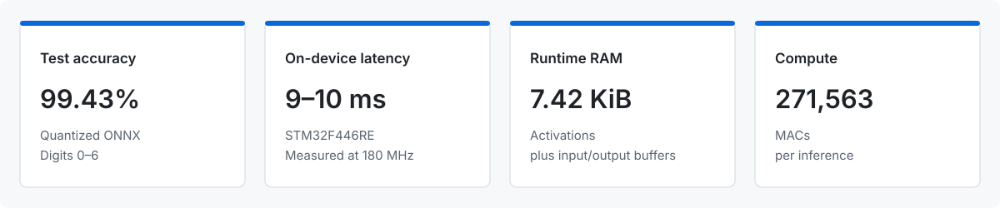
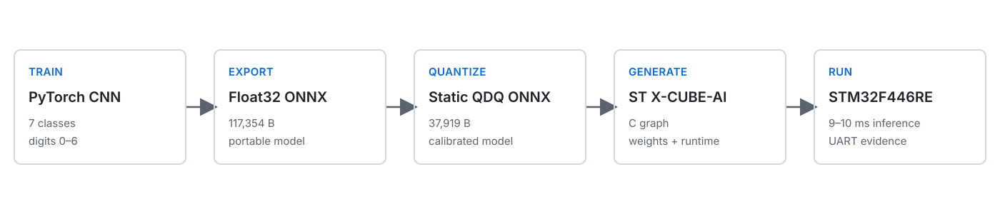

# TinyML MNIST on STM32F446RE

A 7-class MNIST CNN trained in PyTorch, statically quantized through ONNX, and deployed to an STM32F446RE using ST X-CUBE-AI.

<p align="center"></p>

The current model classifies digits **0–6**.

## Pipeline

<p align="center"></p>

The repository contains the training and conversion code, float and quantized model artifacts, X-CUBE-AI-generated network, STM32 application, validation report, and captured UART output.

## Measured Results

### Model accuracy and serialization

Static ONNX quantization reduced the serialized model from 117,354 B to 37,919 B, a **67.7% reduction**, while test accuracy changed from **99.46% to 99.43%**.

These measurements were collected with ONNX Runtime on a desktop CPU over 6,989 MNIST test images from classes 0–6.

| ONNX artifact | Test accuracy | File size |
|---|---:|---:|
| Float32 ONNX | 99.4563% | 117,354 B |
| Statically quantized ONNX | 99.4277% | 37,919 B |

Full measurements are retained in [`artifacts/model_comparison.json`](artifacts/model_comparison.json).

### Embedded deployment

X-CUBE-AI generated a deployment using **105.73 KiB of model weights** and **7.42 KiB of total runtime RAM**, including activation and I/O buffers.

| STM32F446RE deployment metric | Value |
|---|---:|
| Parameters | 28,979 |
| MACs per inference | 271,563 |
| Generated model weights | 108,268 B / 105.73 KiB |
| Activations | 6,808 B / 6.65 KiB |
| Input buffer | 784 B |
| Output buffer | 7 B |
| Total runtime RAM | 7,599 B / 7.42 KiB |
| Input tensor | `uint8 [1,28,28,1]` |
| Output tensor | `uint8 [1,7]` |

The complete target report is retained in [`artifacts/reports/stm32_validation.txt`](artifacts/reports/stm32_validation.txt).

### Hardware latency

Ten committed test samples completed in **9–10 ms per inference** on the STM32F446RE at 180 MHz. The firmware measures each `ai_network_run` call with `HAL_GetTick()`.
## Quantization

Static quantization uses calibration images to determine scales and zero points, then inserts quantize/dequantize operations into the ONNX graph. This allows supported operations to use lower-precision integer tensors, reducing the serialized model from 117,354 B to 37,919 B while changing test accuracy by only −0.0286 percentage points.

Quantizing the ONNX model does not guarantee that every generated embedded operation is integer-only. X-CUBE-AI maps the convolution stages to `uint8`/`int8` operations but retains floating-point arrays in the dense layers. The 37,919-byte ONNX file and the generated 108,268-byte weight array are also different formats and should not be compared as the same storage measurement.

## Model Architecture

The PyTorch model accepts a normalized 28×28 grayscale image and produces seven logits:

```text
1×28×28 input
  → Conv2d(1, 6, 5) → ReLU → MaxPool2d(2)
  → Conv2d(6, 16, 5) → ReLU → MaxPool2d(2)
  → Flatten(256)
  → Linear(256, 100) → ReLU
  → Linear(100, 7)
```

## Repository Structure

```text
TinyML/
├── assets/                      README metric summary and pipeline diagrams
├── training/                    PyTorch training, ONNX export, quantization, comparison
├── artifacts/                   Model files and measured results
│   ├── reports/                 X-CUBE-AI target validation report
│   ├── final_output.txt         Captured on-device UART output
│   ├── model_comparison.json    Desktop ONNX Runtime measurements
│   ├── tiny_mnist_best.pt       PyTorch checkpoint
│   ├── tiny_mnist_best.onnx     Float32 ONNX model
│   └── tiny_mnist_best_quantized.onnx
├── stm/                         STM32CubeIDE project and X-CUBE-AI generated network
└── sample10/                    Source images used for the embedded demonstration
```

## Reproducing the Project

### Desktop pipeline

From the repository root:

```bash
python -m venv .venv
source .venv/bin/activate
pip install -r requirements.txt

python training/train.py
python training/export_onnx.py
python training/quantize.py
python training/compare.py
```

Pretrained and converted artifacts are committed, so retraining is not required to inspect the reported results.

### STM32 deployment

1. Open [`stm/TinyML.ioc`](stm/TinyML.ioc) in STM32CubeMX or STM32CubeIDE.
2. Import `artifacts/tiny_mnist_best_quantized.onnx` into X-CUBE-AI if regenerating the network.
3. Generate code, then build and flash the project for the NUCLEO-F446RE.
4. Open a serial terminal on USART2 at 115200 baud to capture the inference output.

Regenerating X-CUBE-AI code may change generated files according to the installed X-CUBE-AI version; the committed validation report records the deployment measured here.
